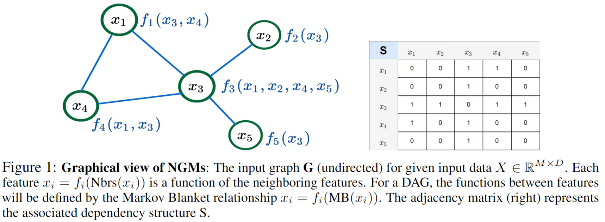
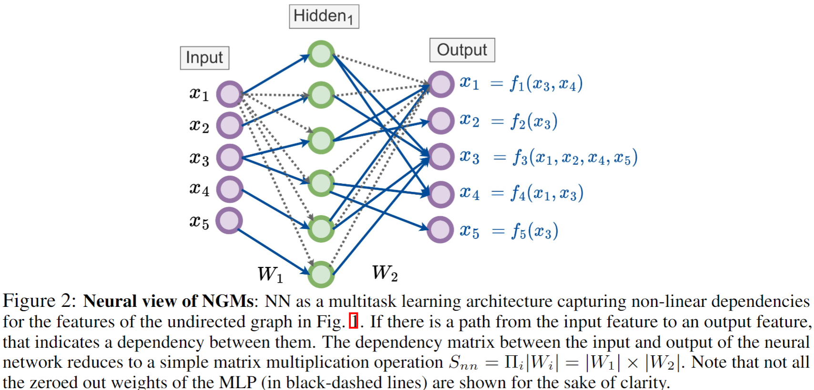
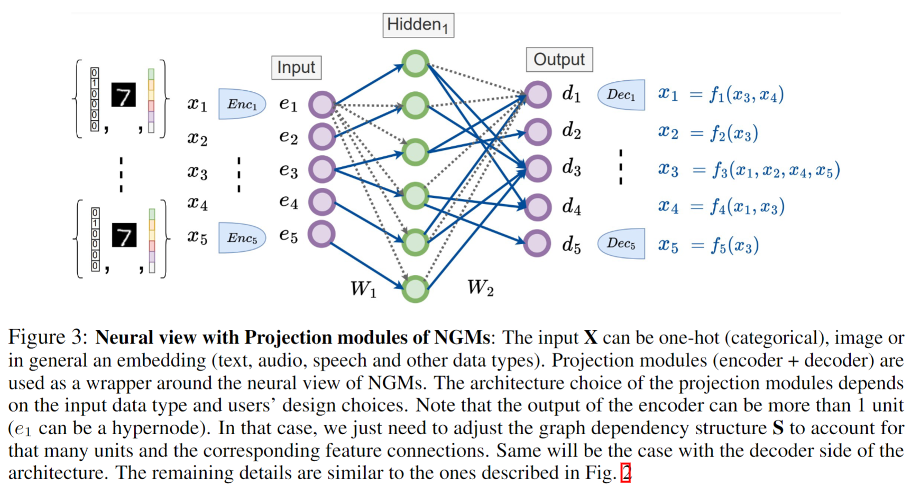
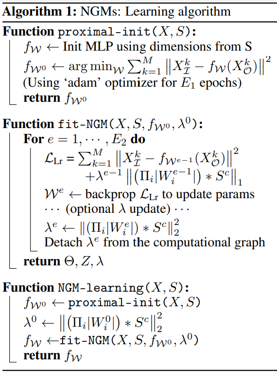
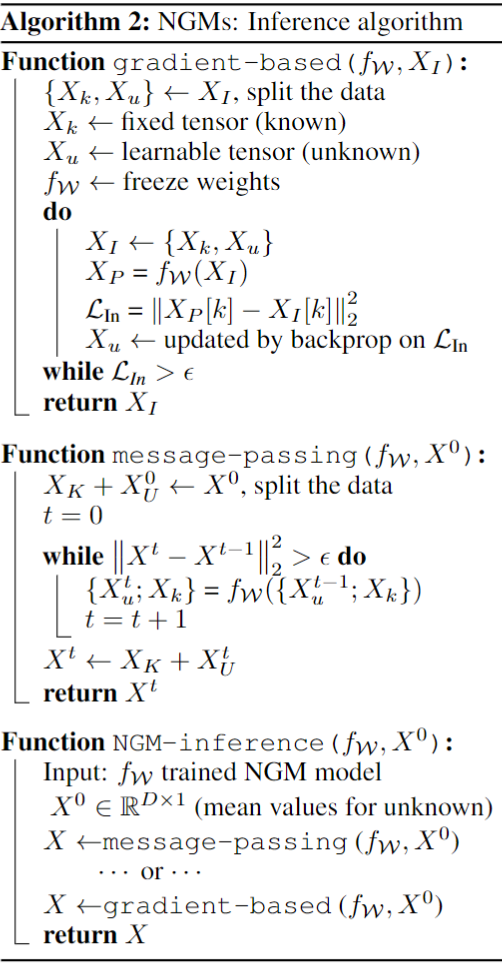
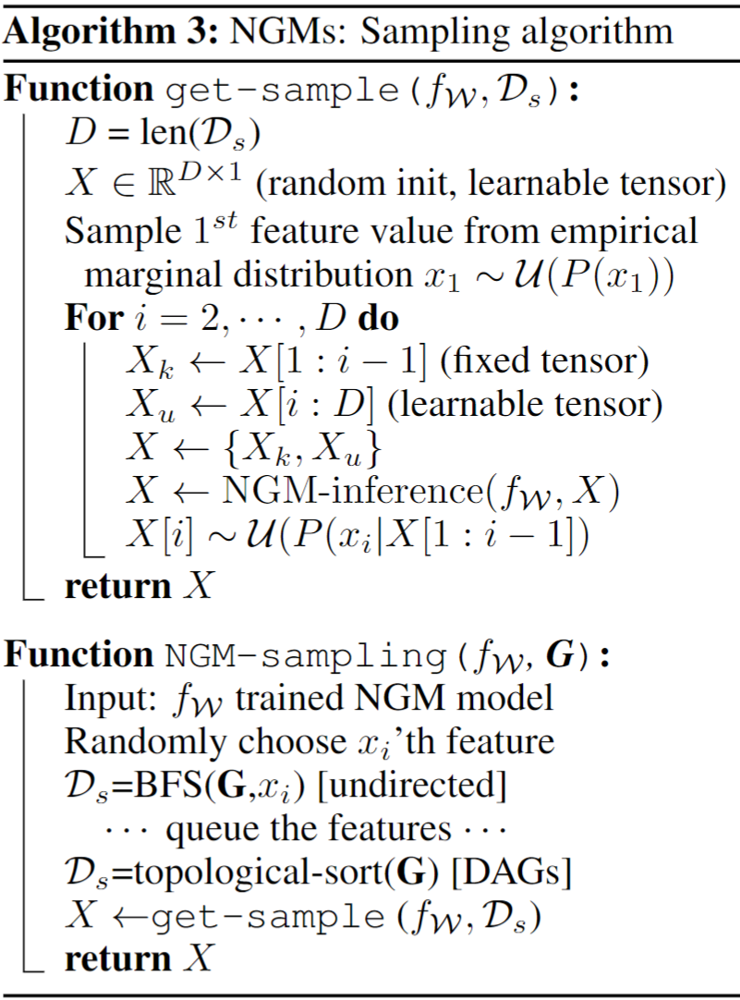

## Neural Graphical Models  
`Neural Graphical Models` (NGMs) attempt to represent complex feature dependencies with reasonable computational costs. Specifically, given a graph, we capture the dependency structure between the features along with their complex function representations by using neural networks as a multi-task learning framework. We provide efficient learning, inference and sampling algorithms for NGMs. Moreover, NGMs can fit generic graph structures including directed, undirected and mixed-edge graphs as well as support mixed input data types.  

Key benefits & features:   
- Facilitate rich representations of complex underlying distributions.  
- Support various relationship types including directed, undirected, mixed-edge graphs.  
- Fast and efficient algorithms for learning, inference and sampling.  
- Direct access to the learned underlying distributions for analysis.  
- Handle different input data types like categorical, images & generic embedding representations.  
- Fast and scalable, supports batch learning with GPU support.  
 

### High level overview  

  

       

       

### Algorithms  

        
        
       

## Setup  
The `setup.sh` file contains the complete procedure of creating a conda environment to run mGLAD model. run `bash setup.sh`    
In case of dependencies conflict, one can alternatively use this command `conda env create --name ngm --file=environment.yml`.  

## demo on representing Gausssian Graphical models (GGMs) using NGMs    
A minimalist working example of NGMs is given in `demo_NGMs.ipynb`. It is a good entry point to understand the code structure as well as NGMs.  

## Citation
If you find this method useful, kindly cite the following associated papers:
- `Neural Graphical Models`: [arxiv](<https://arxiv.org/abs/2210.00453>)  

@article{shrivastava2022neural,  
  title={Neural Graphical Models},  
  author={Shrivastava, Harsh and Chajewska, Urszula},  
  journal={arXiv preprint arXiv:2210.00453},  
  year={2022}  
}   

- `uGLAD`: Sparse graph recovery by optimizing deep unrolled networks. [arxiv](<https://arxiv.org/abs/2205.11610>)  

@inproceedings{  
shrivastava2022a,   
title={A deep learning approach to recover conditional independence graphs},  
author={Harsh Shrivastava and Urszula Chajewska and Robin Abraham and Xinshi Chen},  
booktitle={NeurIPS 2022 Workshop: New Frontiers in Graph Learning},  
year={2022},  
url={https://openreview.net/forum?id=kEwzoI3Am4c}  
}  
